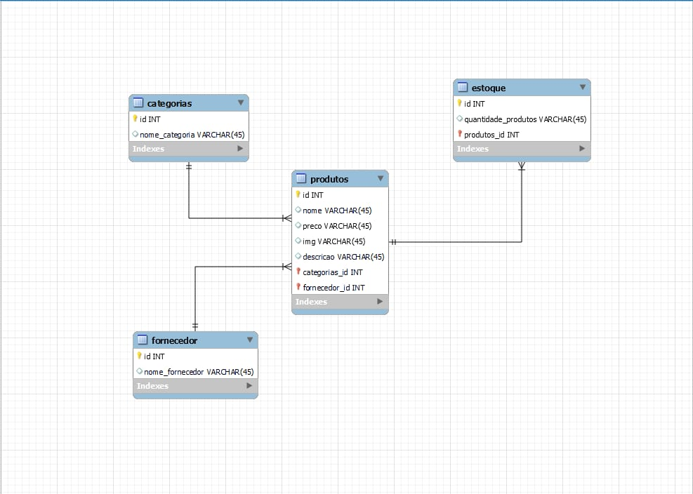

# API PUB PEAK BLINDERS
 Criando uma API para o projeto de um Pub. Esta API é o trabalho de conclusão do módulo 5 do curso de Desenvolvimento Web da Resilia.
 
 ## O projeto 💻
 Nossa equipe foi escolhida para a criação de uma API para um aplicativo. A escolha do tema e das entidades foi feita pelo grupo afim de continuar o projeto do módulo 3 do curso de Desenvolvimento Web FullStack da Resilia. Desta maneira, planejamos unir todo o front end, criado para o módulo 3, com a estrutura back end criada para este módulo 5.
 
 ## Objetivo 📍
⇨ Utilizar o padrão MVC;
⇨ Utilizar os verbos HTTP seguindo o padrão REST;
⇨ Implementar todas as operações de CRUD;
⇨ Utilizar o padrão de projeto (design pattern) DAO para abstração de transações no banco, com Promises;

 ## Time 🧒
 
 <a href="https://github.com/AndrewDeras"> @andrewderas </a>
  
 <a href="https://github.com/FabricioSalema"> @FabricioSalema </a>
  
 <a href="https://github.com/barbmariana"> @barbmariana </a>
  
 <a href="https://github.com/KarenPedro"> @KarenPedro </a>
  
<a href="https://github.com/ruanthow"> @ruanthow </a>
  
 <a href="https://github.com/wesleyrick"> @wesleyrick </a>

 
 
 ## Etapas :bookmark_tabs:
 1. Entendendo o problema
 2. Modelando o Banco   
 3. Criando o Diagrama
 5. Entendendo a API
 6. Criando a API
 
 
## O Problema :shrug:
Para criar nossa API, precisamos de um banco e um projeto bem estruturado. Precisamos entender quais são os objetivos de nossa aplicação e descobrir quais serão as entidades e rotas que existirão.

## Modelando  :abacus:
Somos um Pub. Pretendemos criar uma API para utilizar na nossa página do cardápio e também na nossa seção de administrador para registrar e atualizar produtos. 
Sendo assim, visualizamos algumas entidades para nosso banco. Elas são: Categorias, Produtos, Fornecedor e Estoque. 

 ## Tecnologias 🌐
 
 ## Guia de Uso :hammer:
 
◼ Como instalar as dependências do projeto;
◼ Como executar o projeto;
◼ Quais são as rotas possíveis;
